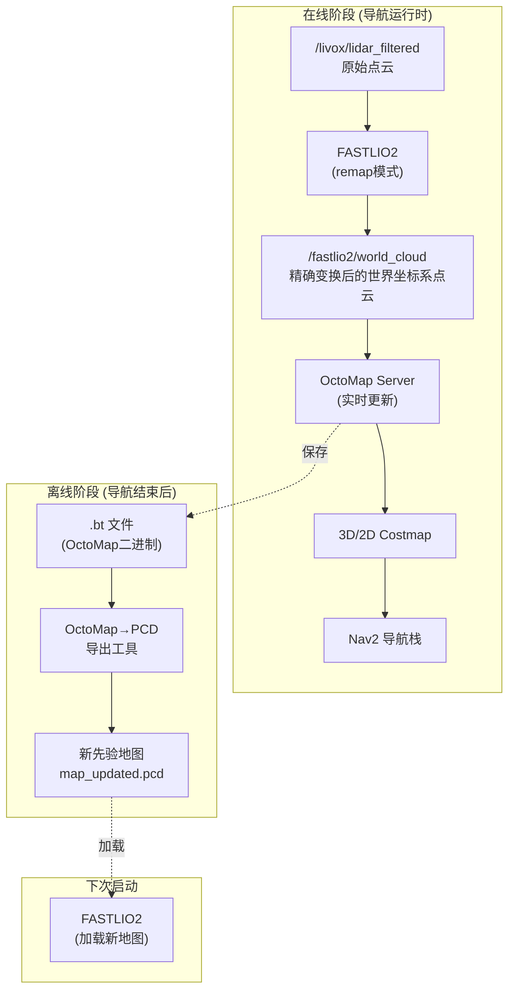
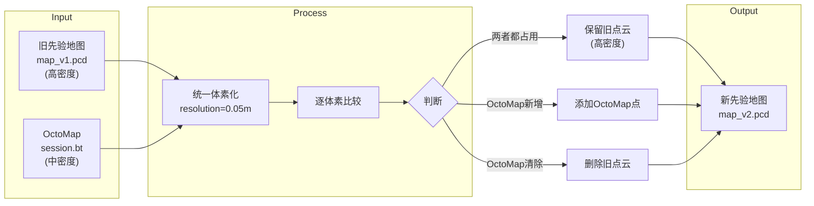

# 地图生命周期管理方案

## 核心需求
持续生成高精度的3d地图，支持导航过程中环境变化的自动更新，避免频繁的人工重建。
不使用独立显卡，仅支持CPU/集成核心显卡计算资源。

## 概述

本文档详细描述了一种基于 **FASTLIO2 + OctoMap** 的增量式地图更新方案，实现导航过程中地图的持续演化，避免周期性重建地图。

## 问题背景

### 当前问题

```
┌─────────────────────────────────────────────────────────────┐
│                     FASTLIO2 Remap 模式的局限                │
├─────────────────────────────────────────────────────────────┤
│                                                             │
│  1. ikd-tree 只支持增量添加，不支持删除                       │
│  2. 先验地图与实际环境差异过大时定位漂移                       │
│  3. 环境变化超过 20-30% 后定位精度显著下降                    │
│  4. 需要人工介入重建地图                                     │
│                                                             │
└─────────────────────────────────────────────────────────────┘
```

### 目标场景

- **环境类型**: 室内仓库（静态为主，偶尔变化）
- **变化频率**: 每天可能有 5-15% 的环境变化（货架移动、物品增减）
- **运行模式**: 每天多次导航任务
- **期望效果**: 每次导航后地图自动演化，适应环境变化

---

## 方案架构

### 整体数据流



### 模块职责划分

| 模块 | 职责 | 输入 | 输出 |
|-----|-----|-----|------|
| FASTLIO2 (remap) | 高精度实时定位 + 点云变换 | 点云 + 先验PCD | TF位姿 + world_cloud |
| OctoMap Server | 概率占用栅格维护 | /fastlio2/world_cloud | 占用栅格 + .bt文件 |
| MapUpdateManager | 地图更新流程管理 | OctoMap状态 | 更新后的PCD |
| Nav2 Costmap | 路径规划代价地图 | OctoMap | costmap |

> **架构优化说明**：直接使用 FASTLIO2 输出的 `/fastlio2/world_cloud`，无需额外的 TransformCloudNode。
> 该点云已使用 IESKF 滤波器的最优位姿进行精确变换，比 TF 查询更精准。

---

## 核心机制详解

### 1. OctoMap 概率更新机制

OctoMap 使用 **log-odds** 概率表示，支持增量更新和自动"遗忘"：

```
占用概率更新公式：

L(n|z₁:t) = L(n|z₁:t-1) + L(n|zt)

其中：
- L(n) = log(P(n) / (1-P(n)))  // log-odds 表示
- L(n|zt) > 0 当激光命中该体素 (hit)
- L(n|zt) < 0 当激光穿过该体素 (miss)
```

#### Ray Casting 示意图

```
激光束路径：
                                    
  传感器 ════════════════════════════► 命中点
         │     │     │     │     │
         ▼     ▼     ▼     ▼     ▼
       miss  miss  miss  miss   hit
       -0.4  -0.4  -0.4  -0.4  +0.7
       
  经过多次扫描，被移走物体的体素概率会降到阈值以下 → 自动"清除"
```

#### 关键参数配置

```yaml
# octomap_server 参数
octomap_server:
  ros__parameters:
    resolution: 0.05          # 体素分辨率 5cm
    frame_id: "map"
    sensor_model:
      max_range: 15.0         # 最大有效距离
      hit: 0.7                # 命中时增加的概率 (log-odds ≈ 0.85)
      miss: 0.4               # 穿过时减少的概率 (log-odds ≈ -0.41)
      min: 0.12               # 概率下限 (防止完全清零)
      max: 0.97               # 概率上限 (防止过度自信)
    occupancy_threshold: 0.5  # 占用判定阈值
    
    # 清除效果计算：
    # 一个 hit=0.7 的体素，需要约 2 次 miss=0.4 穿过才会降到 0.5 以下
```

### 2. 地图演化时间线

```
┌─────────────────────────────────────────────────────────────────────────────┐
│                           地图演化时间线                                     │
├─────────────────────────────────────────────────────────────────────────────┤
│                                                                             │
│  Day 1 AM                                                                   │
│  ├── 首次建图: FASTLIO2 SLAM → map_v1.pcd                                   │
│  └── 初始化: map_v1.pcd → OctoMap (全部设为高占用概率)                        │
│                                                                             │
│  Day 1 PM - 导航任务 #1                                                      │
│  ├── FASTLIO2 remap(map_v1.pcd) 提供定位                                    │
│  ├── OctoMap 实时接收点云，ray casting 更新                                  │
│  │   └── 发现货架A被移走 → 相关体素概率下降                                   │
│  └── 任务结束 → 保存 session_1.bt                                           │
│                                                                             │
│  Day 1 PM - 导航任务 #2                                                      │
│  ├── FASTLIO2 继续使用 map_v1.pcd (仍能定位，变化<20%)                        │
│  ├── OctoMap 继续更新                                                       │
│  │   └── 货架A区域概率已很低，货架B新增 → 新体素高概率                         │
│  └── 任务结束 → 保存 session_2.bt                                           │
│                                                                             │
│  Day 1 Night - 离线更新                                                      │
│  ├── 合并/选择最新 .bt 文件                                                  │
│  ├── 导出: session_2.bt → map_v2.pcd                                        │
│  └── 替换: map_v1.pcd → map_v2.pcd                                          │
│                                                                             │
│  Day 2 AM - 导航任务 #3                                                      │
│  ├── FASTLIO2 remap(map_v2.pcd) ← 已包含昨天的变化                           │
│  ├── 定位精度恢复到最佳                                                      │
│  └── ...循环继续...                                                         │
│                                                                             │
└─────────────────────────────────────────────────────────────────────────────┘
```

### 3. 直接使用 FASTLIO2 输出点云

#### 为什么使用 `/fastlio2/world_cloud`

```
┌─────────────────────────────────────────────────────────────────────────────┐
│                    /fastlio2/world_cloud 的优势                              │
├─────────────────────────────────────────────────────────────────────────────┤
│                                                                             │
│  1. 精确的位姿变换                                                          │
│     └── 使用 IESKF 滤波器输出的最优位姿，而非 TF 查询                        │
│                                                                             │
│  2. 时间对齐                                                                │
│     └── FASTLIO2 内部对 IMU 和 LiDAR 做了精确的时间同步和运动补偿            │
│                                                                             │
│  3. 已降采样                                                                │
│     └── 经过 scan_resolution 体素滤波，点云更干净                           │
│                                                                             │
│  4. 无累积误差                                                              │
│     └── 每帧独立变换，不会有 TF 链的累积延迟问题                            │
│                                                                             │
│  5. 架构简化                                                                │
│     └── 无需额外的 TransformCloudNode，减少中间环节                         │
│                                                                             │
└─────────────────────────────────────────────────────────────────────────────┘
```

#### 方案对比

```
原方案 (已弃用):
/livox/lidar → TransformCloudNode → (TF查询) → /cloud_in_map → OctoMap
                      ↑
              延迟、可能有时间戳偏差

优化方案 (采用):
/livox/lidar → FASTLIO2 → /fastlio2/world_cloud → OctoMap
                              ↑
                   已经是精确的世界坐标系点云！
```

#### OctoMap Server 配置

```yaml
# octomap_server 参数
octomap_server:
  ros__parameters:
    # 直接订阅 FASTLIO2 输出的世界坐标系点云
    cloud_in: "/fastlio2/world_cloud"
    frame_id: "camera_init"  # FASTLIO2 的世界坐标系
    resolution: 0.05
    sensor_model:
      max_range: 15.0
      hit: 0.7
      miss: 0.4
```

#### 注意事项

| 方面 | 说明 |
|------|------|
| **坐标系** | world_cloud 的 frame_id 是 `camera_init`，OctoMap 的 `frame_id` 需匹配 |
| **频率** | world_cloud 默认 10Hz，对 OctoMap 足够 |
| **降采样** | 已按 `scan_resolution` 降采样，OctoMap 分辨率建议设为相近值 |

---

## OctoMap → PCD 导出策略

### 导出算法

```
输入: OctoMap .bt 文件
输出: PCD 点云文件

算法步骤：
1. 加载 .bt 文件到 OcTree 结构
2. 遍历所有叶节点
3. 筛选: 占用概率 > occupancy_threshold
4. 提取体素中心坐标
5. (可选) 体素滤波去重
6. 保存为 PCD 格式
```

### 点云密度控制

```
问题：OctoMap 导出的点可能比原始 FASTLIO2 地图稀疏或密集

原因：
- OctoMap 按体素存储，每个体素只有一个中心点
- FASTLIO2 保留原始点云密度

解决方案：
┌───────────────────────────────────────────────────────────┐
│  方案A: 统一分辨率                                         │
│  - OctoMap resolution = FASTLIO2 期望的点密度              │
│  - 推荐: 0.05m (5cm)                                      │
├───────────────────────────────────────────────────────────┤
│  方案B: 导出后上采样                                       │
│  - 在体素表面生成多个采样点                                │
│  - 计算量较大，一般不推荐                                  │
├───────────────────────────────────────────────────────────┤
│  方案C: 混合策略 (推荐)                                    │
│  - 保留 FASTLIO2 原始高密度区域                            │
│  - 只用 OctoMap 更新变化区域                               │
│  - 需要实现点云融合逻辑                                    │
└───────────────────────────────────────────────────────────┘
```

### 混合融合策略详解



---

## 地图更新触发机制

### 自动触发条件

```yaml
# map_update_manager 参数
map_update_manager:
  ros__parameters:
    # 触发条件 (满足任一即触发)
    trigger:
      # 1. 变化比例阈值
      change_ratio_threshold: 0.15  # OctoMap 15% 体素变化
      
      # 2. 时间间隔
      max_age_hours: 24             # 最多 24 小时不更新
      
      # 3. 定位质量下降
      localization_degradation: true
      fitness_score_threshold: 0.5  # ICP fitness 下降到此值
      
      # 4. 关机时总是更新
      update_on_shutdown: true
```

### 变化检测算法

```
变化比例计算：

change_ratio = (added_voxels + removed_voxels) / total_voxels

其中：
- added_voxels: OctoMap 中占用但旧地图中不存在的体素
- removed_voxels: 旧地图中存在但 OctoMap 中已清除的体素
- total_voxels: 旧地图的总体素数

实现：
1. 将旧 PCD 体素化为 HashSet<VoxelKey>
2. 遍历 OctoMap 占用体素
3. 统计新增/删除数量
4. 计算比例
```

---

## 系统集成

### Launch 文件结构

```
navigation.launch.py
├── fastlio2_remap.launch.py
│   └── FASTLIO2 Node (加载先验地图，输出 /fastlio2/world_cloud)
├── octomap.launch.py
│   └── OctoMap Server Node (订阅 /fastlio2/world_cloud)
├── map_manager.launch.py
│   └── MapUpdateManager Node
└── nav2_bringup.launch.py
    └── Nav2 节点组
```

### Topic 连接图

```
┌─────────────────────────────────────────────────────────────────────────────┐
│                              Topic 数据流 (简化架构)                         │
├─────────────────────────────────────────────────────────────────────────────┤
│                                                                             │
│  /livox/lidar_filtered ──────────────────► FASTLIO2                        │
│  (sensor_msgs/PointCloud2)                    │                             │
│                                               │                             │
│                                    ┌──────────┴──────────┐                  │
│                                    ▼                     ▼                  │
│                        /fastlio2/world_cloud      /tf (map→base_link)      │
│                        (精确变换后的点云)                                    │
│                                    │                                        │
│                                    ▼                                        │
│                            OctoMap Server                                  │
│                                    │                                        │
│                 ┌──────────────────┼──────────────────┐                    │
│                 ▼                  ▼                  ▼                    │
│         /octomap_binary   /octomap_point_cloud   /projected_map            │
│         (octomap_msgs)    (可视化用)              (2D投影)                  │
│                 │                                      │                    │
│                 ▼                                      ▼                    │
│         MapUpdateManager                        Nav2 Costmap               │
│                                                                             │
└─────────────────────────────────────────────────────────────────────────────┘
```

### 服务接口

```
MapUpdateManager 提供的服务：

1. /trigger_map_update (std_srvs/srv/Trigger)
   - 手动触发地图更新
   - 返回: success, message

2. /get_map_status (自定义服务)
   - 查询当前地图状态
   - 返回: change_ratio, last_update_time, total_voxels

3. /save_octomap (std_srvs/srv/Trigger)
   - 保存当前 OctoMap 到文件
   - 返回: success, saved_path
```

---

## 异常处理

### 场景1: FASTLIO2 定位失败

```
检测: FASTLIO2 状态监控 (fitness score / 收敛状态)

处理流程:
1. 记录失败位置和时间
2. 切换到 OctoMap + ICP 备份定位 (精度较低但鲁棒)
3. 立即触发地图更新
4. 通知上层任务暂停/返航

实现:
- 订阅 FASTLIO2 诊断话题
- fitness_score < threshold 持续 N 秒 → 判定失败
```

### 场景2: OctoMap 内存溢出

```
预防:
1. 设置 OctoMap 最大深度 (max_tree_depth: 16)
2. 定期剪枝 (prune() 合并相同概率的相邻体素)
3. 限制地图范围 (filter_ground, point_cloud_min/max_z)

监控:
- 订阅 /octomap_server/memory_usage
- 超过阈值时自动保存并重置

恢复:
- 从 .bt 文件重新加载
- 清理过时数据
```

### 场景3: PCD 导出失败

```
原因:
- 磁盘空间不足
- OctoMap 损坏
- 导出工具异常

处理:
1. 保留上一版本 PCD 作为备份
2. 日志记录详细错误
3. 发送告警通知
4. 下次启动时使用备份地图
```

---

## 性能评估

### 资源占用估算

```
场景假设:
- 地图大小: 50m × 50m × 3m
- OctoMap 分辨率: 0.05m
- 理论最大体素数: 50/0.05 × 50/0.05 × 3/0.05 = 3,000,000

实际占用 (稀疏八叉树):
- 典型占用率: 5-10%
- 实际体素数: 150,000 - 300,000
- 内存占用: 约 50-100 MB

CPU 占用:
- OctoMap 更新: 5-10% (单核)
- 点云变换: 2-5% (单核)
- 总增量: ~15% CPU
```

### 延迟分析

```
在线阶段延迟 (简化架构):

/fastlio2/world_cloud → OctoMap 更新

延迟组成:
- FASTLIO2 内部变换: 已包含在 FASTLIO2 处理中，无额外延迟
- OctoMap 插入: ~10-20ms (含 ray casting)

总延迟: ~10-20ms (比原方案减少 ~10ms)

优势:
- 省去了 TF 查询延迟
- 省去了 PCL 变换计算
- 架构更简单，故障点更少
```

### 离线更新耗时

```
OctoMap → PCD 导出时间:

体素数量    导出时间    PCD文件大小
100,000    ~2秒        ~3MB
300,000    ~5秒        ~10MB
1,000,000  ~15秒       ~30MB

注: 时间主要消耗在文件 I/O，可通过 SSD 加速
```

---

## 实施计划

### Phase 1: 基础框架 (1-2周)

- [ ] 创建 `map_lifecycle` ROS 2 包
- [ ] 实现 TransformCloudNode
- [ ] 集成 octomap_server2
- [ ] 编写 launch 文件

### Phase 2: 导出工具 (1周)

- [ ] 实现 OctoMap → PCD 导出脚本
- [ ] 测试不同分辨率下的导出质量
- [ ] 验证 FASTLIO2 能正确加载导出的 PCD

### Phase 3: 管理器 (1-2周)

- [ ] 实现 MapUpdateManager 节点
- [ ] 添加变化检测逻辑
- [ ] 实现服务接口
- [ ] 添加异常处理

### Phase 4: 集成测试 (1周)

- [ ] 模拟环境变化场景测试
- [ ] 长时间运行稳定性测试
- [ ] 性能调优

---

## 替代方案对比

| 方案 | 优点 | 缺点 | 适用场景 |
|-----|-----|-----|---------|
| **本方案 (FASTLIO2+OctoMap)** | 定位精度高，实现相对简单 | 需要两套系统 | 高精度需求 |
| 纯 Cartographer 增量 | 一体化方案 | 点云质量低 | 对精度要求不高 |
| RTAB-Map 全功能 | 功能最全 | 纯LiDAR性能一般 | 有视觉传感器 |
| 定期重建地图 | 最简单 | 人工介入多 | 环境变化少 |

---

## 附录

### A. 依赖包列表

```xml
<!-- package.xml -->
<depend>rclcpp</depend>
<depend>sensor_msgs</depend>
<depend>tf2_ros</depend>
<depend>pcl_ros</depend>
<depend>octomap_msgs</depend>
<depend>octomap_server</depend>
<depend>std_srvs</depend>
```

### B. 参考资料

- OctoMap 官方文档: https://octomap.github.io/
- octomap_server2: https://github.com/iKrishneel/octomap_server2
- FASTLIO2: https://github.com/hku-mars/FAST_LIO
- Log-odds 概率更新: Thrun, S., Burgard, W., & Fox, D. (2005). Probabilistic Robotics

### C. 文件路径规划

```
/home/firebot/maps/
├── prior/
│   ├── map_current.pcd      # 当前使用的先验地图 (FASTLIO2 加载)
│   ├── map_backup.pcd       # 备份
│   └── map_history/
│       ├── map_20260120.pcd
│       └── map_20260121.pcd
├── octomap/
│   ├── current.bt           # 当前 OctoMap
│   └── sessions/
│       ├── session_20260122_0900.bt
│       └── session_20260122_1400.bt
└── config/
    └── map_manager.yaml     # 配置文件
```
